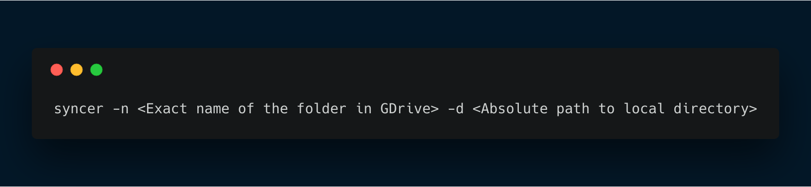

# GDSyncer
Keep a folder in sync with Google drive.

Using GDsyncer you can easily sync files with your Google Drive. It will fetch all the files which are not present in the local directory and upload all the files which are in the local directory but not in the cloud. Currently syncing of nested folders are not supported. 

## Instructions
1.Execute the binary by providing the name of the folder in GDrive and the corresponding local folder as arguments.

2. That's it! Simple as that!

